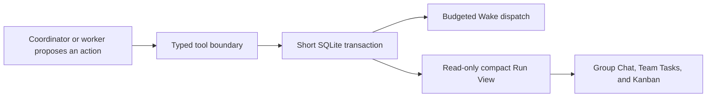

# Agent Org PR Review Correctness and Performance Audit

- Date: 2026-07-16
- Scope: the two review rounds on PR #373 and the minimum dependencies needed to make those fixes compile, run, and remain testable
- Status: implementation audit and A-only verification complete, with documented clean-develop baselines
- Verification date: 2026-07-18

## Executive summary

This follow-up keeps Agent Org's product model unchanged: coordinators and workers still reason about the work, while Rust owns durable state transitions and the frontend renders persisted facts. The implementation and this report are limited to the two review rounds and the minimum dependencies required to make those fixes correct and independently testable.

The reviewed production path is:

## Scope boundary

Included here:

- the first review's read-path, polling, payload, locking, task-graph, finality, Wake-budget, and error-isolation findings;
- the second review's failure finality, Plan approval, Inbox receipt, Task authority, legacy dependency, extractor, Kanban, wire-parity, and test-fidelity findings;
- stable `useSyncExternalStore` Snapshot identity, keyset Group Chat history, canonical finality/progress helpers, transactional Task outbox, Inbox materialization receipts, and real-Run fixtures as required dependencies;
- dispatch-time user-intervention establishment for direct and queued user messages: intervention is persisted after the durable user event and immediately before provider dispatch; persistence failure stops dispatch;
- focused tests and these English audit reports.

This audit intentionally contains only the two review rounds and their required integration dependencies. Later hardening and future architectural work are tracked outside this branch.

## Review finding matrix

### First review

| Finding                                               | Risk                                                                                        | In-scope resolution                                                                                                                         |
| ----------------------------------------------------- | ------------------------------------------------------------------------------------------- | ------------------------------------------------------------------------------------------------------------------------------------------- |
| Run View reads performed writes                       | Frequent UI polling could take the global writer lock and mutate lifecycle state.           | Run View now reads a deferred, read-only Snapshot. Reconciliation and intervention cleanup remain explicit write operations.                |
| `task_list` used the global writer path               | A read-only tool could serialize unrelated Task, Session, and Inbox work.                   | `task_list` uses a read transaction and returns bounded summaries; `task_get` loads full detail on demand.                                  |
| Poll payloads grew with Inbox, Plan, and Task content | Every poll copied large durable payloads and repeated frontend parsing.                     | Run View carries counts, previews, and Plan summaries. Full Plan, Task, Inbox, and Group Chat data use explicit detail or keyset APIs.      |
| Task board loading repeated graph work                | Repeated lists and per-Task dependency scans created N+1 behavior.                          | A transaction-local `TaskGraphIndex` is built once and shared by mutation and outbox decisions.                                             |
| Finality checks disagreed                             | A Run could repeatedly reconcile without reaching a stable terminal decision.               | Finality facts, assessment, and decision are centralized; minimal work revision and explicit empty-Run completion provide durable evidence. |
| Idle Wake bypassed recovery budget                    | Some paths could call the model repeatedly while watchdog paths backed off.                 | Production Wake sources use durable reserve, enqueue, and commit-or-refund accounting.                                                      |
| Plan and text persistence lacked direct bounds        | One request could write an unexpectedly large Plan, feedback, Task description, or message. | Review-requested content fields are validated before file, SQLite, or Inbox persistence. Historical rows remain until Run deletion.         |
| File I/O occurred while holding the writer lock       | Slow Plan writes could block unrelated Agent Org updates.                                   | Plan content is staged outside the lock; the lock protects only the short transaction and atomic installation step.                         |
| Synchronous SQLite ran on async execution threads     | Database calls could stall unrelated async work.                                            | Synchronous persistence work runs in a blocking section and reuses one connection per operation.                                            |
| Frontend reparsed completed results                   | Large result wrappers were parsed repeatedly during render.                                 | Explicit outcomes return early, and Task outcome resolution is memoized at the adapter boundary.                                            |
| `task_graph_create` was not extracted consistently    | Communication cards or replay could show raw JSON or erase existing Kanban state.           | Rust extraction, Task cards, event routing, and additive Kanban replay recognize Task Graph outcomes.                                       |
| One bad Run stopped watchdog scanning                 | A single database or analysis error could prevent later Runs from recovering.               | Watchdog reports an inner per-Run error and continues scanning remaining Runs.                                                              |

### Second review

| Finding                                                         | Risk                                                                       | In-scope resolution                                                                                                                                                      |
| --------------------------------------------------------------- | -------------------------------------------------------------------------- | ------------------------------------------------------------------------------------------------------------------------------------------------------------------------ |
| A failed or cancelled worker immediately abandoned the Run      | Recoverable work could be declared terminal.                               | Run-terminalization paths covered by this review use the shared finality model; abandonment requires all relevant workers to be archived and no recovery path to remain. |
| Task Graph rendered inconsistently                              | Some surfaces showed raw JSON and historical replay could clear the board. | All three UI projections consume structured graph outcomes and merge graph creation additively.                                                                          |
| Rust E2E fixtures skipped a real Run                            | Tests could pass while violating production Run invariants.                | Fixtures initialize the canonical schema and create an actual Running Run before exercising Agent Org commands.                                                          |
| Watchdog hid errors or accepted an empty plan forever           | Runs could remain stuck without an observable recovery action.             | Errors remain visible per Run; a rejected reconcile continues to Wake valid work or emits the minimum coordinator repair notice.                                         |
| Empty-task Runs could not complete                              | A coordinator that legitimately needed no Tasks had no terminal action.    | The minimal `org_run_complete` path records explicit coordinator completion intent and still passes canonical finality checks.                                           |
| Pause or restart cancelled pending Plan approval                | User approval state disappeared even though the Run was not terminal.      | Pending approval survives pause and restart; only terminal or missing Runs clear it.                                                                                     |
| Crash windows could duplicate Inbox delivery                    | The durable row and visible turn could diverge after restart.              | Inbox materialization receipts and `causation_inbox_id` make acknowledgement conditional on successful materialization.                                                  |
| Legacy `blocks` did not participate in readiness                | Old Tasks could unlock too early.                                          | `blocks` is normalized into the canonical dependency graph used by every readiness check.                                                                                |
| Workers could delete ownerless Tasks                            | A worker could remove coordinator-managed work it did not own.             | Ownerless Task deletion is coordinator-only.                                                                                                                             |
| Approval persisted but notification failure returned UI failure | The user could retry an approval that was already committed.               | Approval state and Inbox notification commit together; Wake happens after commit and stale revisions return a readable error.                                            |
| TypeScript treated args-only operations as success              | A failed tool attempt could mutate historical Kanban state.                | New events require a structured outcome; legacy events require durable result evidence. Successful deletion removes the Task row from replay.                            |
| Rust and TypeScript wires drifted                               | `executionMode` and Task output could be absent or duplicated.             | `executionMode` is explicit and Task output has one canonical wire location.                                                                                             |
| Tests initialized a weaker schema                               | Test-only behavior could mask missing tables or invalid Run state.         | Production and tests share schema initialization and real-Run invariants; test-only bypasses are removed.                                                                |

### Required integration dependency

| Dependency                           | Why it is required                                                                                                                                      | A-only implementation                                                                                                                                                                                                                 |
| ------------------------------------ | ------------------------------------------------------------------------------------------------------------------------------------------------------- | ------------------------------------------------------------------------------------------------------------------------------------------------------------------------------------------------------------------------------------- |
| User intervention at actual dispatch | A direct or queued user message must prevent a background Wake from racing the same member, but merely waiting in the queue must not suppress recovery. | Direct messages establish intervention after the durable user event and immediately before provider dispatch. Queued messages establish it only when dequeued for dispatch. Both paths fail closed if intervention persistence fails. |

## Ten-layer architecture audit

| Layer                                 | Result                            | Evidence and boundary                                                                                                                                                                                       |
| ------------------------------------- | --------------------------------- | ----------------------------------------------------------------------------------------------------------------------------------------------------------------------------------------------------------- |
| 1. Compilation and static correctness | Verified with baseline exceptions | Rust compilation, TypeScript typecheck, formatting, frontend lint, and circular-dependency checks pass. Strict Clippy remains blocked by clean-develop findings documented below.                           |
| 2. Dead code and duplicate paths      | Reviewed                          | Run reads, finality, Task graph evaluation, Task outbox, Plan persistence, Wake budgeting, and user-intervention dispatch were reviewed for competing paths; no duplicate A-only production path was found. |
| 3. Naming consistency                 | Reviewed                          | Run, Session, Task, delivery, Snapshot, Wake, and work revision remain distinct concepts.                                                                                                                   |
| 4. Semantic overloading               | Reviewed                          | Run status does not stand in for Session, Task, or Inbox state; finality consumes typed facts across those dimensions.                                                                                      |
| 5. Default branches                   | Reviewed                          | Paused, terminal, failed, missing, stale approval, legacy outcome, and rejected tool states fail closed or return explicit guidance.                                                                        |
| 6. Cross-domain leakage               | Reviewed                          | Models reason; Rust validates and persists; the scheduler dispatches; the frontend projects durable state.                                                                                                  |
| 7. New-developer comprehension        | Reviewed                          | Mutation outcomes, finality blockers, Wake outcomes, and Plan summaries use typed structures rather than human-text parsing.                                                                                |
| 8. Wire protocol and payloads         | Reviewed                          | Polling returns summaries and exact counts; detail endpoints carry complete content; outcome evidence is explicit.                                                                                          |
| 9. Initialization parity              | Reviewed                          | Production, unit tests, and HTTP E2E use the shared schema and real Run records.                                                                                                                            |
| 10. Resolver symmetry                 | Not applicable                    | This scope does not change a multi-field fallback resolver. Relevant identity and fallback paths were reviewed and no asymmetric resolution was introduced.                                                 |

## Core invariants retained by this scope

1. Only a Running Run may mutate Tasks.
2. Ownerless means unassigned, not available for arbitrary worker self-claim.
3. A normal worker may mutate only its own assigned work state.
4. Task mutation and its TaskAssigned or TaskCompleted outbox share one transaction result.
5. Wake attempts are charged only after scheduler acceptance; rejected and coalesced requests are refunded.
6. A Paused or terminal Run is rechecked before Wake execution and cannot be revived accidentally.
7. Plan approval is durable independently of transient Wake delivery.
8. Completion requires the coordinator to observe the latest work revision and pass the shared finality decision.
9. Historical Group Chat remains available through keyset pagination after reload.
10. Task and Plan UI state comes from structured persisted outcomes, not attempted tool arguments.
11. A user message establishes member intervention only when it is actually dispatched. A message waiting in the queue does not suppress Wake, and failure to persist intervention prevents provider dispatch.

## Verification status

The implementation was split after a larger combined audit. Only results produced from the A-only tree are reported here.

| Gate                                            | A-only result                                                                                                                                                 |
| ----------------------------------------------- | ------------------------------------------------------------------------------------------------------------------------------------------------------------- |
| Rust compilation and focused review regressions | Pass. The Agent Org compilation and focused review suites complete successfully.                                                                              |
| `agent_core` application suite                  | Pass: 3,028 / 3,028. The 23 `specialization::external_import` tests are filtered because the same nested `lock_home` deadlock is reproduced on clean develop. |
| `session_persistence`                           | Pass: 29 / 29.                                                                                                                                                |
| Frontend unit and static verification           | Pass: Vitest 5,318 / 5,318; TypeScript typecheck, ESLint, and circular-dependency checks pass.                                                                |
| Changed-scope Rust formatting                   | Pass: all 80 Rust files changed relative to develop pass `rustfmt --check`.                                                                                   |
| Strict Clippy                                   | Baseline-blocked; no new A-only warning is known. See the baseline note below.                                                                                |
| Isolated real Debug App Agent Org HTTP E2E      | Pass: 46 / 46 against the real isolated Debug App and production behavior paths.                                                                              |
| Rendered WebDriver Group Chat E2E               | 5 / 6 pass. The remaining mention-menu scenario fails identically on clean develop and is not an A regression.                                                |
| Rendered WebDriver Pause/Resume E2E             | Pass: 8 / 8.                                                                                                                                                  |
| Rendered WebDriver Recovery E2E                 | Pass: 2 / 2.                                                                                                                                                  |

### Clean-develop baseline exceptions

- Strict workspace Clippy is blocked by seven `orgtrack_core` diagnostics reproduced on clean develop.
- `agent_core --no-deps` reports 45 diagnostics reproduced on clean develop.
- `e2e-test --no-deps` reports three diagnostics on A versus four on clean develop, so A does not add a Clippy diagnostic.
- Workspace-wide `cargo fmt --all --check` reports formatting drift in unchanged develop files; every Rust file changed by A passes an explicit `rustfmt --check`.
- The 23 filtered `specialization::external_import` tests enter the same nested non-reentrant `lock_home` deadlock on clean develop. They are reported explicitly rather than counted as passing.
- The rendered mention-menu scenario fails on A and clean develop with the same `Agent Org mention menu did not include both member and normal context options` assertion. It is not counted as passing and is outside this A-only follow-up.

## Conclusion

The A-only tree addresses the two review rounds and their minimum correctness dependencies. Source-level, unit, integration, real Debug App HTTP, and all in-scope rendered UI verification are complete. The one remaining rendered scenario is a reproduced clean-develop baseline outside this follow-up, not an A regression.
