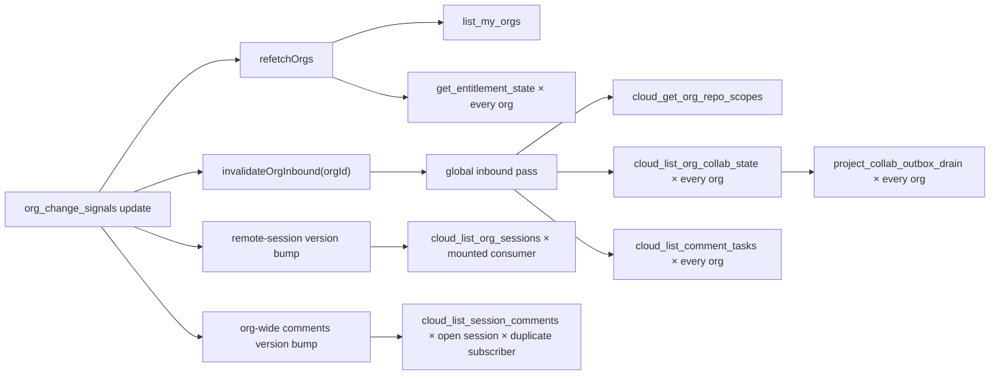

# Shared-session polling architecture audit

Scope: managed-cloud shared sessions (`Org2Cloud` + the surviving `TeamCollaboration` project bridge), including the root sync/realtime entry points, comments, remote-session listings, project/work-item sync, comment-task execution, and the API-call hotspot UI shown in the supplied capture.

## Outcome

The dominant problem is not a collection of independent timers. It is one coarse Realtime invalidation that behaves like event-driven polling: every `org_change_signals` row update fans out into roster, entitlement, repo-scope, project/work-item, comment-task, remote-session, and open-comment-thread reads. Several of those reads then multiply across every org or across duplicate mounted consumers.

Implementation update: the client-side multipliers identified here are now fixed. Realtime inbound requests are per-org and delta-preserving, reconnect is the only full-listing path, waiting no longer starts a second pass, ordinary signals no longer read the org roster, and sharing-policy recovery is a per-org entitlement read capped at once per minute. Remote-session/comment requests share keyed deduplication, optimistic comment mutations notify peers without invalidating themselves, Realtime-only project pulls skip the outbox drain, roster changes reload only members, and address-comment completion is event-driven with a 60-second deadman check. The remaining coarse behavior requires a server wire-protocol change: `org_change_signals` still lacks a plane, entity/session hint, origin, and monotonic per-plane revision.

The screenshot is consistent with this call graph:

- 9 `cloud_list_org_collab_state`, 9 `project_collab_outbox_drain`, and 9 `cloud_list_comment_tasks` calls form one repeated sync-cycle cluster.
- 18 `cloud_list_session_comments` calls are consistent with two simultaneously mounted `useSessionComments` consumers for the same session. The second forced subscriber queues a second fetch behind the first.
- 16 `list_my_orgs` calls versus 9 serialized sync cycles are consistent with Realtime callbacks starting roster reads without the sync engine's coalescing.
- The panel says **9 likely polling** but renders only six cards because `PanelContent.tsx` uses `hotspots.slice(0, 6)`. The exact identities of the hidden three are not recoverable from the PNG. Source-derived candidates are `get_entitlement_state`, `cloud_list_org_sessions`, and `project_collab_apply_remote` when a non-empty full listing is repeatedly applied.

## Acceptance criteria for a polling fix

- One ordinary server mutation causes at most one coalesced delta pull for the affected org and affected plane.
- A normal Realtime event does not clear full-listing latches; only initial connect/reconnect or an explicit revocation-reconciliation event requests a full listing.
- A change in org A does not pull project or comment-task state for org B.
- Project/work-item/comment/session changes do not refetch `list_my_orgs`, entitlement, members, or repo scopes.
- One comments invalidation causes at most one listing for the affected session regardless of mounted surfaces; an already-patched local mutation causes no local listing.
- One remote-session invalidation causes at most one listing per org regardless of sidebar/panel consumers.
- Attaching a waiter to an active sync pass does not mark that pass dirty or schedule another pass.
- An empty project outbox is not drained on every inbound pull.
- Long-running address-comment runs observe authoritative session-finality events; status polling is fallback-only.
- The hotspot UI can reveal all groups that contribute to its “likely polling” count.

## Finding sweep

| Priority | Line / element                                                                                                                                                     | Verdict          | Reason                                                                                                                                                                                                                                                                                                                                                             | Suggested change                                                                                                                                                                                                                                                                                                                           |
| -------- | ------------------------------------------------------------------------------------------------------------------------------------------------------------------ | ---------------- | ------------------------------------------------------------------------------------------------------------------------------------------------------------------------------------------------------------------------------------------------------------------------------------------------------------------------------------------------------------------ | ------------------------------------------------------------------------------------------------------------------------------------------------------------------------------------------------------------------------------------------------------------------------------------------------------------------------------------------ |
| P0       | `useOrg2CloudRealtime.ts:215-233` — `org_change_signals` `onChange`                                                                                                | fix              | One untyped org-wide event triggers roster refetch, entitlement hydration, full inbound sync, remote-session refresh, every open comment thread, and task-runner work. A session push, project update, work-item update, task heartbeat, or comment edit all pay for unrelated planes.                                                                             | Put plane/revision/session metadata on the signal (or split signals by plane). Coalesce by `(orgId, plane)` and dispatch only the affected consumers. Include an origin/revision so a client can cheaply ignore or acknowledge its own already-applied write.                                                                              |
| P0       | `org2CloudSyncEngine.ts:521-536, 909-961` — `forceInboundNextPass`                                                                                                 | fix              | The caller supplies `orgId`, but the engine stores one global boolean. The next inbound pass loops over **all orgs**, so one org's event pulls every org's project/work-item and task planes.                                                                                                                                                                      | Replace the boolean with pending per-org plane masks, e.g. `Map<orgId, Set<plane>>`; consume only requested orgs/planes. Reserve an explicit all-org mode for reconnect recovery.                                                                                                                                                          |
| P0       | `org2CloudSyncEngine.ts:523-527, 1070-1078, 1145-1153` — full-listing latch reset                                                                                  | fix              | Every ordinary signal deletes the affected org's full-listing latches. The next project and task reads therefore omit their persisted cursors and fetch complete listings, defeating the delta design documented in those methods.                                                                                                                                 | Keep cursors/latches for ordinary change events. Request `full` only on initial subscribe/reconnect, membership/visibility revocation, or a signal that explicitly says absence reconciliation is required.                                                                                                                                |
| P0       | `useOrg2CloudRealtime.ts:220`; `org2CloudOrgsAtom.ts:308-366` — roster/entitlement refresh                                                                         | fix              | Every broad change signal invokes `list_my_orgs`; every successful refetch then launches `get_entitlement_state` once per org. Calls are not single-flight, so bursts still spend network work even when older responses are discarded by request epochs.                                                                                                          | Refetch roster only on membership/org lifecycle events. Give roster and entitlement separate cached stores, single-flight per key, TTL/backoff, and explicit invalidations. Do not hydrate entitlements as a side effect of every roster read.                                                                                             |
| P0       | `SessionCommentsHeaderExtras.tsx:50-58`; `SessionCommentsContext.tsx:202-216`; `org2CloudSessionCommentsAtom.ts:460-483, 538-542` — duplicate comments subscribers | fix              | The active shared session mounts two `useSessionComments` instances for the same key. On a forced signal the first claims the fetch; the second sees `loading` and records `queue_force`, guaranteeing a second sequential listing even though both observed the same signal generation. This matches the screenshot's 18 comment calls versus 9 sync-cycle calls. | Move invalidation consumption into a module-level keyed request coordinator, deduped by signal generation. Alternatively make the header consume a shared session-level store/provider bridge instead of owning a second fetching hook. Queue a second force only when its server revision is newer than the in-flight request's revision. |
| P1       | `org2CloudCommentsBus.ts:59-70`; `org2CloudSessionCommentsAtom.ts:651-729`; `SessionCommentsContext.tsx:256-270` — local broadcasts                                | fix              | Add/edit/delete/resolve already patch the local atom from the mutation result, but `broadcastCommentsChanged` also bumps the local signal and forces a listing. Task creation explicitly calls `refresh()` and then bumps the same signal. With two consumers this commonly becomes two follow-up listings, followed later by the durable org signal.              | Split “notify peers” from “invalidate this client.” Optimistically patched callers should broadcast to peers without bumping local fetch state. Callers lacking a returned row should perform one keyed local refresh, not both `refresh()` and local broadcast invalidation.                                                              |
| P1       | `org2CloudRemoteSessionsAtom.ts:122-183`; `cloudSessionsSection.tsx:159`; `CloudSessionsSection.tsx:37` — per-hook request locks                                   | fix              | Sidebar and cloud-management session sections can mount for the same org. Each hook instance owns its own in-flight set and last-version map, so both may issue `cloud_list_org_sessions` for one invalidation. The broad signal also bumps this list for project/task/comment-only changes.                                                                       | Store the in-flight promise and processed revision at module/store scope by org. Invalidate this list only for session/share/access changes. Reuse the returned server session row after local push/share mutations where possible.                                                                                                        |
| P1       | `useOrg2CloudRealtime.ts:220-224`; `org2CloudSyncEngine.ts:474-509, 521-536` — invalidate then wait                                                                | fix              | `invalidateOrgInbound()` starts `runSyncPass()` immediately. The following `runSyncPassAndWaitForDrain()` calls `runSyncPass()` again; because a pass is active, it sets `passDirty`, guaranteeing a follow-up pass merely to attach a waiter. The same pattern appears in `resumeOrg(); runSyncPassAndWaitForDrain()` callers.                                    | Expose one request API that records intent and optionally returns a drain promise, e.g. `requestSync(intent, { wait: true })`. Attaching a waiter must not itself set dirty. Dirty should mean new unconsumed work only.                                                                                                                   |
| P1       | `ProjectSyncChannel.ts:115-119, 142-152` — unconditional outbox drain                                                                                              | fix              | Every project pull calls `pushOutbox`, which invokes `project_collab_outbox_drain` even when no local mutation exists. The screenshot's drain count exactly tracks project-state pulls.                                                                                                                                                                            | Separate inbound apply from outbound drain. Maintain a per-org dirty/pending signal from local mutations and Rust retry deadlines; drain only when dirty/retry is due. The low-frequency safety pass may retain a bounded pending probe.                                                                                                   |
| P1       | `ProjectSyncChannel.ts:121-139`; `org2CloudSyncEngine.ts:1070-1093` — repeated full remote apply                                                                   | fix              | Resetting the full-listing latch means the same non-empty project/work-item set is repeatedly sent through `project_collab_apply_remote`; Rust may no-op it, but IPC, decoding, and field comparisons are still paid. `notifyDataChanged` can then schedule another projects pass when anything applies.                                                           | Preserve delta cursors on normal events and include a server revision gate before IPC. Keep the existing `entities.length === 0` skip; add “revision already applied” identity/no-op protection before calling the bridge.                                                                                                                 |
| P2       | `CloudOrgPanelView/index.tsx:254-330` — roster-version effect                                                                                                      | fix              | A teammate membership change makes the panel refetch entitlement, full member roster, and repo scopes together. Only the member roster is necessarily stale; the other calls can appear as hidden hotspots while the panel is open.                                                                                                                                | Split the panel loaders by data owner and invalidation key. Membership version refreshes members; plan/policy refreshes entitlement; scope-policy version refreshes scopes. Back them with shared per-org caches.                                                                                                                          |
| P2       | `addressCommentsRun.ts:388-400` — 4-second status poll                                                                                                             | fix              | While an address-comments run is active, `SessionService.getStatus` runs 15 times/minute for up to 15 minutes (up to 225 status calls), despite the app already having session lifecycle/event infrastructure. This is not in the six visible cloud RPC cards but is shared-session-specific polling.                                                              | Await the authoritative turn/session terminal event or lifecycle store with a generation guard. Retain a much slower deadman poll only for dropped-event recovery and preserve the 15-minute deadline.                                                                                                                                     |
| P2       | `router/index.tsx:26-35`; `org2CloudSyncEngine.ts:412-430`; `useOrg2CloudRealtime.ts:167-180, 235-243` — startup/reconnect burst                                   | fix              | Root startup independently starts an immediate sync pass, a roster subscribe compensation read, and one full inbound invalidation per org. Near-simultaneous subscriptions are serialized but can leave dirty follow-ups and duplicate complete listings.                                                                                                          | Add a bootstrap barrier: load roster, establish subscriptions, then issue one all-org full reconciliation generation. Reconnects should coalesce true-edge status events across channels into one bounded recovery pass.                                                                                                                   |
| P3       | `PanelContent.tsx:60-64, 77-79` — hotspot visibility                                                                                                               | fix              | The heading counts every likely-polling group but the UI renders only the first six, which is why the capture says 9 while showing 6. This hides lower-rate multipliers from the exact workflow used to diagnose them.                                                                                                                                             | Add “show all”/expand behavior or render all likely-polling rows before non-polling rows. Preserve the six-card compact default only when the count is six or fewer.                                                                                                                                                                       |
| Keep     | `org2CloudSyncEngine.ts:151-198, 544-573` — recurring safety chain                                                                                                 | keep with reason | One 60-second visible timer, stretched to five minutes while hidden, is a reasonable outbound safety net. Inbound work is already gated to five minutes and scopes/events to ten minutes. The timer is not the source of the 4.5-9/min rates; the coarse invalidation bypass is.                                                                                   | Keep the single chain, but make every pass consume precise dirty/revision state. Consider moving the ordinary visible safety cadence to five minutes once event-driven outbound coverage is proven.                                                                                                                                        |
| Keep     | `commentTaskRunner.ts:388-416`; `org2CloudCommentTasksClient.ts:40-44` — lease heartbeat                                                                           | keep with reason | A 60-second heartbeat renews a 15-minute fenced lease and carries bounded progress only while a real task is running. It is protocol maintenance, not idle polling.                                                                                                                                                                                                | Keep. Ensure heartbeats do not invalidate unrelated planes; their task-plane signal should update only that task/org.                                                                                                                                                                                                                      |
| Keep     | `org2CloudRealtimeClient.ts:258-315` — presence retry                                                                                                              | keep with reason | The one-second retry is failure-driven, coalesced to the latest payload, and constrained by a connection-wide five-calls/30-second scheduler. It is not an always-on loop.                                                                                                                                                                                         | Keep; expose retry counts in push/timer diagnostics if it becomes noisy.                                                                                                                                                                                                                                                                   |
| Keep     | `org2CloudOrgsAtom.ts:197-285` — initial roster retry                                                                                                              | keep with reason | The 2/5/10/20-second retry sequence is bounded and exists only after initial-load failure. The excessive roster traffic comes from unbounded broad-signal refetches, not this recovery sequence.                                                                                                                                                                   | Keep the bounded recovery, but share its single-flight/backoff state with imperative roster refreshes.                                                                                                                                                                                                                                     |

## Pre-fix trigger / call matrix

| Trigger                          | Current remote/IPC effects                                                                                                                                                                                                                     | Excess mechanism                                                                                   |
| -------------------------------- | ---------------------------------------------------------------------------------------------------------------------------------------------------------------------------------------------------------------------------------------------- | -------------------------------------------------------------------------------------------------- |
| Any `org_change_signals` change  | `list_my_orgs`; `get_entitlement_state × orgs`; scopes for invalidated org; project/task pulls for all orgs; outbox drains for all orgs; remote-session listing for mounted active org; comment listings for every mounted open session in org | Coarse signal, global boolean, full-latch reset, per-hook locks, no roster single-flight           |
| Local shared-session event write | 3-second debounced sync; session metadata/events push; server signal echoes back into the full fan-out above                                                                                                                                   | Legitimate outbound write causes broad self-invalidation                                           |
| Local project/work-item mutation | 1.5-second project pass; project pull + outbox drain/push; server signal; possible remote-apply `orgii-data-changed` follow-up                                                                                                                 | Push and pull are inseparable; empty drains and one accepted echo pass                             |
| Local comment mutation           | Mutation RPC; local atom patch; local forced listing; peer broadcast; durable org signal; another forced listing                                                                                                                               | Local notification is conflated with peer invalidation; duplicate subscribers queue a second force |
| Realtime reconnect/startup       | Roster read plus one full invalidation per org plus independent bootstrap sync                                                                                                                                                                 | No connection-generation bootstrap barrier                                                         |
| Address-comments execution       | `session_get_status` every 4 seconds; task lease heartbeat every 60 seconds when applicable                                                                                                                                                    | Status completion is polled rather than observed; heartbeat is intentional                         |

## Term-overloading sweep

| Term                          | Current meanings                                                                                                                                              | Verdict                                                                                                                      |
| ----------------------------- | ------------------------------------------------------------------------------------------------------------------------------------------------------------- | ---------------------------------------------------------------------------------------------------------------------------- |
| `org_change_signals`          | Session rows, comments, tasks, projects, work items, sharing policy, and possibly scope/entitlement changes                                                   | fix — one name/payload cannot express which consumer is stale                                                                |
| `invalidateOrgInbound(orgId)` | Clear backoff, clear full-listing state, clear scope TTL, force all-org inbound work, and start execution                                                     | fix — invalidation intent and scheduling are overloaded                                                                      |
| `runSyncPass`                 | Session outbound push, repo-scope hydration, project pull, project outbox push, comment-task pull, reconciliation, and retry                                  | keep only behind plane-specific intent; the current entry point is too broad for every trigger                               |
| `force` comments refresh      | A genuinely newer server revision, a duplicate subscriber observing the same signal, an explicit user refresh, or a mutation caller requesting reconciliation | fix — carry a revision/reason so equal work dedupes and newer work queues                                                    |
| “polling” in DevTools         | Fixed timers and repeated event-driven fetch loops are both classified from repeated automatic calls                                                          | keep with reason — the monitor correctly exposes the user-visible cost even when the trigger is Realtime rather than a timer |

## Ten-layer audit

| Layer | Area inspected                     | Verdict | Reason / evidence                                                                                                                                                                                                                                       | Suggested change                                                                                                                                                                   |
| ----: | ---------------------------------- | ------- | ------------------------------------------------------------------------------------------------------------------------------------------------------------------------------------------------------------------------------------------------------- | ---------------------------------------------------------------------------------------------------------------------------------------------------------------------------------- |
|     1 | Compilation correctness            | pass    | Full TypeScript check passes. Six focused suites pass: 139 tests, including scoped/delta Realtime pulls, pull-only project-channel coverage, and event-driven status completion.                                                                        | Keep the focused call-budget assertions as regression gates.                                                                                                                       |
|     2 | Dead code / structural duplication | fix     | Two comments fetch owners and two possible remote-session fetch owners exist for the same keys; push/pull scheduling also has parallel “invalidate then wait” entry points.                                                                             | Centralize keyed request ownership and sync intent scheduling.                                                                                                                     |
|     3 | Naming consistency                 | fix     | `invalidateOrgInbound(orgId)` sounds org-scoped but sets a global inbound flag and clears unrelated caches/latches.                                                                                                                                     | Name intent explicitly: org set, plane mask, delta/full mode, wait policy.                                                                                                         |
|     4 | Semantic overloading               | fix     | One change signal and one sync pass carry several unrelated domains. `force` cannot distinguish a newer revision from a duplicate observer.                                                                                                             | Use typed plane/revision/origin signals and reasoned fetch requests.                                                                                                               |
|     5 | Default-branch analysis            | fix     | With no plane discriminator, the implicit default is “refresh everything.” With no revision discriminator, the default forced in-flight behavior is “queue another fetch.” These defaults are unsafe under new signal producers or new consumers.       | Make exhaustive plane handling mandatory and ignore equal/older revisions.                                                                                                         |
|     6 | Cross-domain leakage               | fix     | The Realtime React hook directly orchestrates roster, entitlement, sync engine, sidebar sessions, comments, and task execution. Transport delivery knows product-domain refresh policy.                                                                 | Route transport frames into a domain-neutral invalidation coordinator; each domain consumes its own typed revision.                                                                |
|     7 | New-developer clarity              | fix     | Comments claim the engine has the only recurring pull and header atom sharing prevents duplicate fetches, but event-driven refetches and forced queueing violate the practical guarantee.                                                               | Document call budgets and ownership invariants next to the coordinator; replace comments that describe timer count with end-to-end request-count guarantees.                       |
|     8 | Wire protocol / serialization      | fix     | `org_change_signals` carries insufficient invalidation information: the client has only org identity, not plane/session/entity revision or origin. That forces full RPC reads to discover what changed.                                                 | Extend the signal row/payload or use per-plane signal rows with monotonic revisions and optional entity/session hints. Inspect the actual Realtime payload in an integration test. |
|     9 | Entry-point parity                 | fix     | Bootstrap timer, visibility resume, local event activity, local project mutations, Realtime, reconnect compensation, and user policy changes all enter the same pass with different intent, and some callers start then separately wait.                | One `requestSync(intent)` entry point should merge intent monotonically and provide optional drain completion without scheduling duplicate work.                                   |
|    10 | Resolver symmetry                  | fix     | The method accepts one org, clears only that org's latches, then resolves work through an all-org boolean. Comments resolve a session key but also listen to an org-wide wildcard. Scope, project, task, and session refresh dimensions are asymmetric. | Carry org and plane identity through every stage; resolve only targeted keys, with an explicit all-org/all-plane recovery mode.                                                    |

## Implementation status

1. Done client-side: coalescing per-org sync intent, delta-preserving ordinary invalidations, full reconnect recovery, and one drainable request API.
2. Partly done: roster was removed from broad signals and inbound work is org-scoped. Server-side plane/revision/origin metadata remains the highest-value follow-up.
3. Done: comments dedupe by signal generation, remote-session locks/version watermarks are store-shared, and peer-only comment broadcasts avoid local read-after-write fetches.
4. Done: Realtime-only project pulls do not probe the outbox; address-comment status uses the session store with a sparse recovery check.
5. Partly done: focused request-count regressions and all likely-polling DevTools cards are present. A dual-instance end-to-end call-budget assertion remains recommended.

## Verification performed

- Systematic source sweep for `setInterval`, recursive `setTimeout`, polling/status loops, Realtime invalidations, forced refreshes, sync-pass entry points, and all cloud RPC names across `Org2Cloud` and `TeamCollaboration`.
- Forward call-chain trace from the router root and `org_change_signals` callback through roster, sync, project bridge, remote-session, comments, and task-runner consumers.
- Mount trace confirming the duplicate comments consumers and the possible duplicate remote-session consumers.
- Full typecheck: `pnpm typecheck` — passed.
- Focused tests: `pnpm vitest run src/features/Org2Cloud/org2CloudSyncEngine.test.ts src/features/Org2Cloud/org2CloudSessionCommentsAtom.test.ts src/features/Org2Cloud/addressCommentsRun.test.ts src/features/Org2Cloud/org2CloudOrgsAtom.test.ts src/features/TeamCollaboration/engine/ProjectSyncChannel.test.ts src/modules/shared/DevTools/APICallPanel/components/PanelContent.test.ts` — 139/139 passed.
